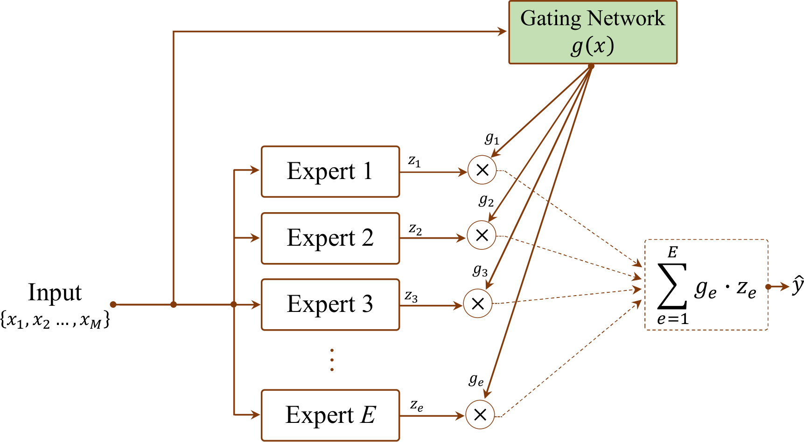

# Mixture-of-Experts and Gating Mechanisms in Multimodal Biomedical Learning: A Routing-Centric Analysis

Official code for the paper:  
**"Mixture-of-Experts and Gating Mechanisms in Multimodal Biomedical Learning: A Routing-Centric Analysis"**

## Overview





This repository implements a controlled comparison of six gating architectures. These architectures are defined in Axis 1 of our taxonomy.

| Code | Gating Type | Description |
|------|-------------|-------------|
| A1.0 | Baseline | Simple concatenation without gating |
| A1.1 | GMU | Gated Multimodal Unit with sigmoid gating |
| A1.2 | Sparse Top k MoE | 4 experts with top 2 selection and load balancing loss |
| A1.3 | Soft Gate | Fully differentiable routing via learned dispatch weights |
| A1.4 | Cross Attention | Bidirectional multi head cross attention gating |
| A1.5 | Modality Specific | Dedicated expert branches per modality |

All architectures share identical encoders. We use ResNet50 and BiLSTM. This ensures fair comparison.

## Datasets

| Dataset | Total | Train | Val | Test | Task |
|---------|-------|-------|-----|------|------|
| [VQA-RAD](https://osf.io/89kps/) | 1,192 | 807 | 171 | 214 | Binary VQA |
| [SLAKE](https://www.med-vqa.com/slake/) | 2,394 | 1,681 | 358 | 355 | Binary VQA |
| [Derm7pt](https://derm.cs.sfu.ca/Welcome.html) | 1,011 | 413 | 203 | 395 | Melanoma classification |

## Dataset Splits

All dataset splits are fixed for reproducibility.
* **SLAKE** and **Derm7pt**: We use the official predefined splits from the original authors.
* **VQA-RAD**: We use train_test_split from scikit-learn with fixed random seeds. The seeds are 42, 43, 44, 45, and 46. This ensures the exact same data subsets for every run.

## Project Structure

```text
├── config
│   └── __init__.py
├── models
│   └── __init__.py
├── utils
│   ├── __init__.py
│   ├── datasets.py
│   └── training.py
├── .gitignore
├── evaluate.py
├── README.md
├── requirements.txt
├── train.py
├── train_backbone.py
└── visualize.py
```

## Requirements

* Python 3.9 or higher
* PyTorch 2.0 or higher with CUDA support
* NVIDIA GPU

```bash
pip install -r requirements.txt
```

## Usage

### Experiment A

This runs 90 training runs in total. It includes 5 seeds, 6 models, and 3 datasets.

```bash
python train.py \
    --vqarad_root /path/to/VQA_RAD \
    --slake_root /path/to/SLAKE \
    --derm7pt_root /path/to/derm7pt/release_v0 \
    --output_dir ./results
```

### Experiment B

This evaluates the best model. It tests three degradation conditions.

```bash
python evaluate.py \
    --vqarad_root /path/to/VQA_RAD \
    --slake_root /path/to/SLAKE \
    --derm7pt_root /path/to/derm7pt/release_v0 \
    --checkpoint_dir ./results \
    --output_dir ./results
```

### Visualization

This generates Figure 5. It also runs Wilcoxon tests.

```bash
python visualize.py --results_dir ./results
```

### Optional Backbone Pretraining

```bash
python train_backbone.py \
    --vqarad_root /path/to/VQA_RAD \
    --slake_root /path/to/SLAKE \
    --derm7pt_root /path/to/derm7pt/release_v0 \
    --dataset vqarad \
    --output_dir ./results
```

## Training Configuration

| Parameter | Value |
|-----------|-------|
| Image size | 224 by 224 |
| Batch size | 128 |
| Learning rate | 0.0002 |
| Weight decay | 0.0001 |
| Scheduler | OneCycleLR |
| Early stopping | patience is 8 |
| Mixed precision | FP16 |
| Seeds | 42, 43, 44, 45, 46 |

## Citation

If you use this code, please cite:

```bibtex
@article{nguyen2026moe_gating_survey,
  title={Mixture-of-Experts and Gating Mechanisms in Multimodal 
         Biomedical Learning: A Routing-Centric Analysis},
  author={Nguyen, Ba-Duy and Hoang, Van-Dung and Nguyen, Hien D.},
  year={2026},
  journal={Network Modeling Analysis in Health Informatics 
           and Bioinformatics}
}
```

## License

This project is for academic research purposes only.
